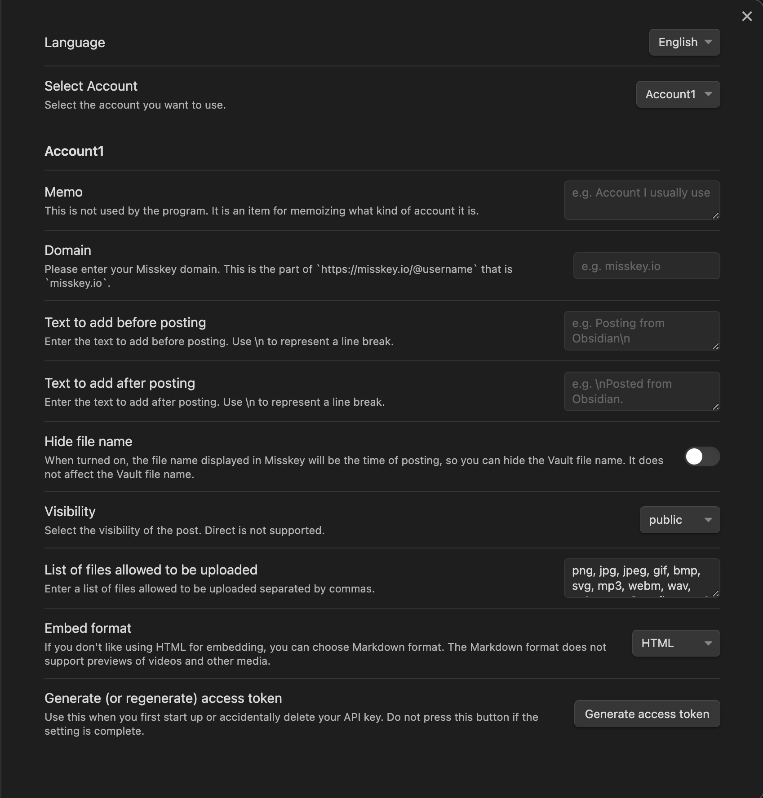

# Obsidian Plugin for Misskey

[日本語はこちら](./documents/ja-JP/README.md)

## Features

Adds commands to embed a Misskey note in quote format `Embed a Misskey note` and to post the current line to Misskey `Post the current line to Misskey`.
    ※ A Misskey account is required to use these features.

The posting command supports options such as tagging, limiting files to upload, and anonymizing file names during upload. It can be used with both Japanese and machine-translated English.

## Initial Setup

1. Open settings and select "Misskey Connector" from Community Plugins.
2. Enter your account's domain in "Domain". (For example, enter misskey.io for <https://misskey.io/@minimarimo3>.)

3. Press the "Generate Access Token" button at the bottom. A browser will open with a screen like the one shown in the image, so please press "Allow" promptly.

4. Once you press "Allow", the initial setup is complete.

## How to Use

### `Embed a Misskey Note`

Paste the URL of a Misskey note into Obsidian, and execute the `Embed a Misskey note` command on the line containing the URL.

The following settings are available:

- Change of embedding format
  This plugin uses HTML to embed images and videos. This can be switched to Markdown format in the settings.

### `Post the Current Line to Misskey`

Execute the `Post the current line to Misskey` command on the line where you have text you wish to post to Misskey. If there are media files like images or videos on the same line, they will also be attached and posted.

The following settings are available:

- Insertion of text before and after the post content
  You can insert any text before and after the post content. This can be used for tagging, for example.
- Anonymizing file names
  Normally, when posting files, the local file names are used as is on Misskey. Turning this option on will keep the local file names intact, but change the file names displayed on Misskey to the time of posting.
- Adjusting the visibility range
  You can choose the visibility range from public, home, followers. Direct is not supported.
- Setting allowable file extensions for upload
  You can specify that only files with certain extensions can be uploaded.

## Contact

For feature requests or bug reports, please contact us through GitHub, [@minimarimo3@misskey.io](https://misskey.io/@minimarimo3), or the [Google Form](https://forms.gle/K4EecLTgpERZRrbq5).
