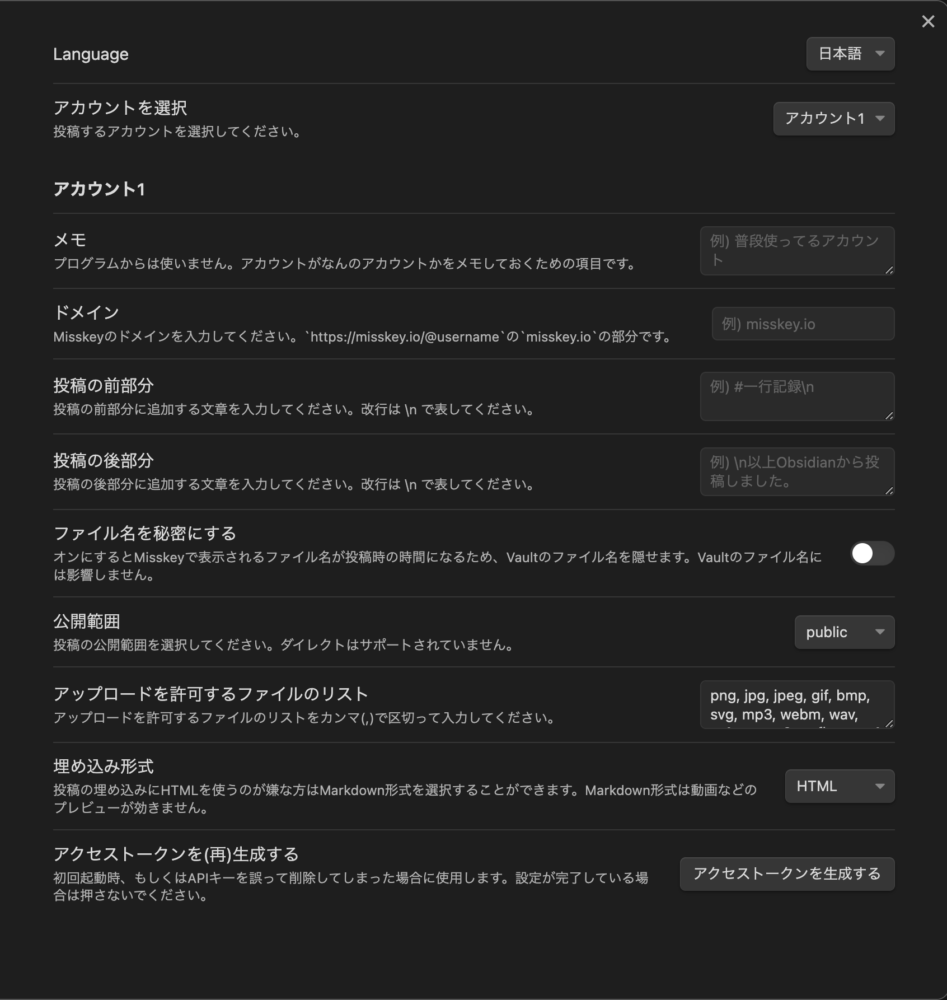
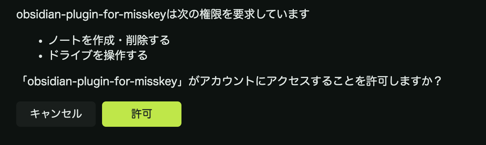

# Obsidian-plugin-for-misskey

## できること

Misskeyのノートを引用形式で埋め込む`Embed a Misskey note`と、現在カーソルがある行をMisskeyに投稿する`Post the current line to Misskey`コマンドを追加します。
    ※ 使用にはMisskeyアカウントが必要です

投稿コマンドは投稿時のタグ付けやアップロードするファイルの制限、アップロード時のファイル名秘匿化などのオプションが使用可能です。日本語と機械翻訳した英語で使えます。

## 初期設定

1. 設定を開き、コミュニティプラグインの「Misskey Connector」を選択します。
2. 「ドメイン」に自分のアカウントのドメインを入力します。(<https://misskey.io/@minimarimo3> ならmisskey.ioを入力してください。)

3. 一番下にある「アクセストークンを生成する」ボタンを押してください。するとブラウザが開き、画像のような画面が出てくるので早めに「許可」を押してください。

Q. これは何?それとなんで必要なの? A. これは[MiAuthというMisskeyが提供している認証方式](https://misskey-hub.net/ja/docs/for-developers/api/token/miauth/)です。今回は「ノートを作成・削除する」権限と「ドライブを操作する」権限を求めています。ドライブの操作はメディアのアップロードに必要です。
4. 許可を押したら初期設定は完了です。

## 使い方

### `Embed a Misskey note`

MisskeyのノートがあるURLをObsidianに貼り付け、対象のURLがある行で`Embed a Misskey note`コマンドを実行してください。

以下の設定が可能です。

- 埋め込み形式の変更
  - このプラグインは画像や動画の埋め込みにHTMLを使用します。これは設定からMarkdown形式に切り替えることができす。

### `Post the current line to Misskey`

Misskeyに投稿したい文章がある行で`Post the current line to Misskey`コマンドを実行してください。同じ行に画像や動画のようなメディアがある場合、それらも添付され投稿されます。

以下の設定が可能です。

- 投稿内容の前後への文章挿入
  - 投稿内容の前後に任意の文章を入力することができます。例えばタグ付けなどに使うことができます。
- ファイル名の秘匿化
  - 通常の状態ではファイルを投稿する際、ローカルのファイル名がMisskeyでもそのまま使われます。このオプションをオンにするとローカルのファイル名はそのままに、Misskeyで表示されるファイル名を投稿時の時刻に変えます。
- 公開範囲の調整
  - public, home, followersから公開範囲を選択できます。ダイレクトはサポートしません。
- アップロードを許可するファイル拡張子の設定
  - 特定の拡張子のファイルのみアップロードといったことが可能になります。

## ライセンス

このプロジェクトはMITライセンスで公開されている[i18next](https://www.i18next.com)を使用しています。より詳細な情報については [i18nextのGitHubリポジトリ](https://github.com/i18next/i18next)を参照してください。
また、このプロジェクトはMITライセンスで公開しています。詳しくは[LICENSE.md](../../LICENSE)ファイルを参照してください。

## 連絡先

追加して欲しい機能やバグなどはGitHubか[@minimarimo3@misskey.io](https://misskey.io/@minimarimo3)か[Googleフォーム](https://forms.gle/K4EecLTgpERZRrbq5)までお願いします。
